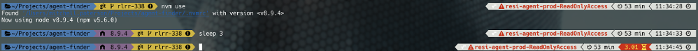
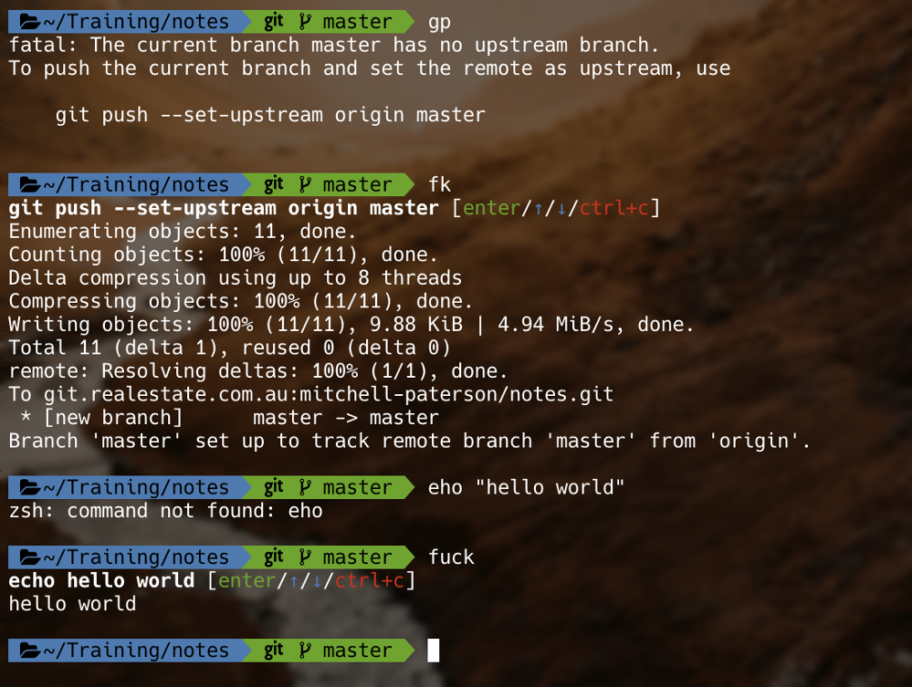
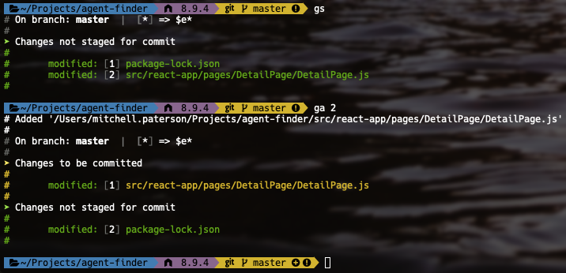

# Terminal Tools

This repo stores a readme with some cool terminal tools.

## Oh My Zsh - For *nix Terminals

Thanks to Rajesh Durai‌ for recommending this one!

ZSH, also called the Z shell, is an extended version of the Bourne Shell (sh), with plenty of new features, and support for plugins and themes. Since it’s based on the same shell as Bash, ZSH has many of the same features, and switching over is a breeze.

ZSH has too many features to list here, some just minor improvements to Bash, but here are some of the major ones:

Automatic cd: Just type the name of the directory
Recursive path expansion: For example “/u/lo/b” expands to “/usr/local/bin”
Spelling correction and approximate completion: If you make a minor mistake typing a directory name, ZSH will fix it for you
Plugin and theme support: ZSH includes many different plugin frameworks

## Powerline9k

Credit to Dave Greig‌ for recommending this to me.

Powerlevel9k is a theme for ZSH which uses Powerline Fonts. It can be used with vanilla ZSH or ZSH frameworks such as Oh-My-Zsh, Prezto, Antigen, and many others.

This just adds a bunch of useful info to your terminal like:

How long previous command took if longer than 1000ms.
What AWS account you are logged into
Node version you are using for repo
And over 9000 more things...

 Check out Dave Greig‌'s custom repo for a timer on you aws login  here: https://git.realestate.com.au/dave-greig/aws-timer

## reveal.js

Credit to Arnaud Dumont‌ for pointing this one out.

A framework for easily creating beautiful presentations using HTML. Check out the live demo.

reveal.js comes with a broad range of features including nested slides, Markdown contents, PDF export, speaker notes and a JavaScript API. There's also a fully featured visual editor and platform for sharing reveal.js presentations at slides.com.

## TheFk

Juan Ojeda‌ recommended this one to me.

It's a magnificent app which corrects your previous console command. I've got it shortcutted to `fk` instead, but the original `fuck` still works.

## SCM Breeze

Thanks to Paolo Napolitano‌ for showing me this one.

SCM Breeze is a set of shell scripts (for bash and zsh) that enhance your interaction with git. It integrates with your shell to give you numbered file shortcuts, a repository index with tab completion, and many other useful features.

## Bat

Thanks to Justin Lam‌ for this one!

It's cat but better:

## zsh-autosuggestions

Thanks to Matilda Stevenson‌ for pointing me to this one.

This gives auto-suggestions based on your command history, which can be completed with the right arrow key. Tab completion still works as expected as well.

## diff-so-fancy

Justin Lam‌ with the recommendation on this one.

diff-so-fancy strives to make your git diff's human readable instead of machine readable. This helps improve code quality and help you spot defects faster.

Vanilla git diff vs git and diff-so-fancy:

## Cowsay + Fortune

Thanks to Duncan Bayne‌ for recommending these two.

I've put Cowsay and Fortune together as I think that's the best way to use them.

A quick explanation of both:

Cowsay makes whatever text you give, be said by an ASCII cow:

Fortune gives you a random quote:

When you pipe Fortune into Cowsay:

Then add the line

fortune | cowsay

the last thing in your `.zshrc` or `.bash_profile` or whatever you use:

Voila! You now have a friendly cow feeding you quotes when you open your terminal!
